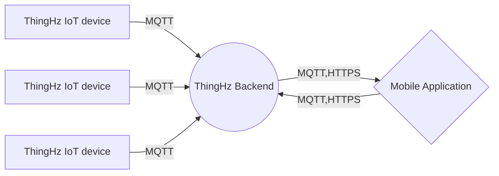

# ThingHz Mobile Application

**ThingHz** android mobile application is a one stop solution to control and monitor all the ThingHz range of IoT devices. This application is specificaly created to facilitate indoor agriculture workflow using real time monitoring and automation solutions.
User can effectivaly manage, control and monitor IoT devices in real time using this mobile applcation. It provides secure authenticaltion and authorization of user using AWS cognito. It provides one click secure provisioning of IoT devices using AWS IoT core. 
Know more about ThingHz IoT devices in this [github repository](https://github.com/ThingHz/thinghz) 

# Features
- **Secure commisioning of devices**:  
QR code provisioning of devices. It provides secure provisioning of device using SSL device certificates using AWS IoT core APIs
- **Manage IoT devices effectively**:
User can effectivaly manage and fiter the devices on the basis of sensor profile, device status and esccalation levels
- **Real Time monitoring**: 
It helps user to monitor real time data form the device. Based on the sensor profile, user can categorize iot devices and can monitor different sensor parameters like temperature,  humidity, CO2 levels, Light intensity etc. This application uses MQTT pub-sub model to fetch data.
- **Automation**: Using this applcation user can control IoT devices remotely. User can automate lights,  irrigation, air flow etc. 
- **Analysis**: User can analyze data of the remote devices using graph and charts. 
- **Data Download**: User can download data of the devices from mobile applciation. This mobile application provides the feature to download 15days, 1 week and  2 days of data.
- **Record Keeping**: User can keep the records of his experiments, objectives and yiedl from ThingHz mobile application.  

## ThingHz range of IoT devices
ThingHz mobile application can control following devices
### ThingHz smart Tissue culture rack:
This device is used in Plant tissue culture labs, mushroom culture and algaculture labs. This helps the reasearcher to monitor and control the environmental parameters in the lab.

### ThingHz FarmSense
This device provides the real time monitoring and automation capabilities to indoor farm

Know more about ThingHz IoT devices in this [github repository](https://github.com/ThingHz/thinghz) 

## ThingHz IoT Backend 
ThingHz Backend is made using AWS Serverless architecture. It uses different AWS microservices such as
- **AWS IoT core**: It is used for IoT device management and commsioning. IT is also used to setup publish and subscribe rules.
- **AWS Cognito**:It is used for User managemant. 
- **Dynamo DB**:It is used to store user related information and device metadata.
- **AWS Time stream**: It is used to store Device Data
- **API Gateway**: This microservice is used to configure REST APIs.

Know more about ThingHz IoT backend in this [github repository]

## Project FlowChart:

